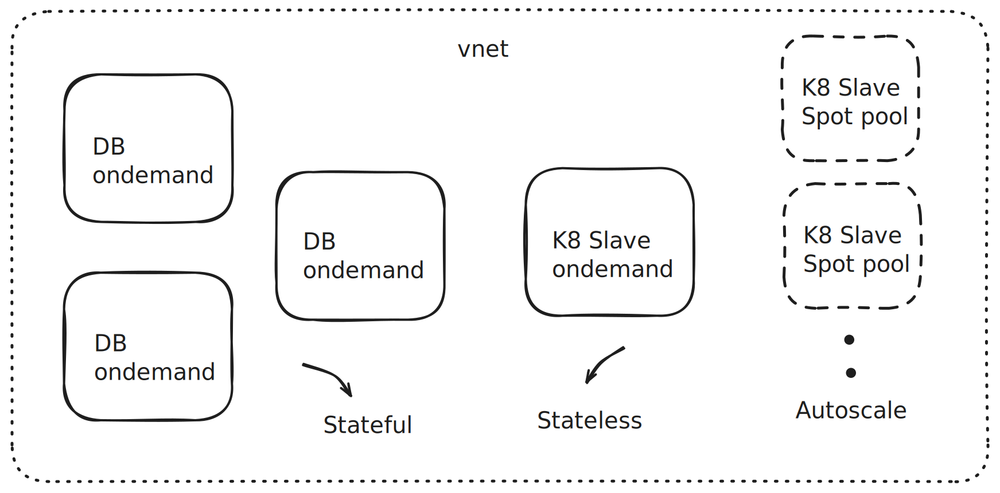

# Multi-Cloud Kubernetes Infrastructure with Terraform


This repository contains production-grade Terraform code for provisioning scalable Kubernetes clusters across multiple cloud providers (AWS, GCP, Azure). It is designed to be a robust, reusable boilerplate for creating both stateless and stateful application infrastructures.

## Key Features

-   **Multi-Cloud Support:** Deploy consistent Kubernetes infrastructure on AWS, GCP and Azure.
-   **Automated Scaling:** Natively supports autoscaling at both the Pod (HPA) and Node (Cluster Autoscaler) levels.
-   **Workspace Ready:** Utilizes Terraform Workspaces to easily manage multiple environments (e.g., `staging`, `production`) with the same codebase.
-   **Stateful & Stateless Design:** Provides a foundation for running any workload, from simple web apps to complex data services.

## Architecture Overview

The diagram below illustrates the high-level architecture, including the automated scaling mechanism that responds to sudden traffic increases. This applies to all Cloud providers.



### How Autoscaling Works

This infrastructure is built to handle dynamic workloads seamlessly:
1.  **Traffic Spike:** As user traffic increases, the CPU/memory load on the existing pods rises.
2.  **Pod Autoscaling (HPA):** The **Horizontal Pod Autoscaler (HPA)** detects this increased load and automatically provisions new application pods to distribute the work.
3.  **Node Autoscaling (Cluster Autoscaler):** If the new pods cannot be scheduled due to a lack of resources, the **Cluster Autoscaler** detects the pending pods and automatically provisions new VMs (nodes) to the cluster to accommodate them.

This two-tiered approach ensures both cost-efficiency during low traffic and high availability during traffic spikes.

## Prerequisites

-   Terraform CLI installed.
-   Access credentials configured for your target cloud provider (e.g., via AWS CLI, gcloud CLI, Azure CLI).
-   `kubectl` installed to interact with the cluster.

## Getting Started

1.  **Clone the Repository:**
    ```sh
    git clone [your-repository-url]
    cd [repository-directory]
    ```

2.  **Configure Your Deployment:**
    -   Navigate to the directory for your chosen cloud provider.
    -   Edit `terraform.tfvars` to define your desired configuration (e.g., region, machine types, node count).

3.  **Deploy the Infrastructure:**
    ```sh
    # Initialize Terraform
    terraform init

    # Apply the configuration to create the cluster
    terraform apply
    ```

4.  **Destroy the Infrastructure:**
    When you are finished, you can tear down all created resources:
    ```sh
    terraform destroy
    ```

## Advanced Usage

### Managing Multiple Environments

To create and manage distinct environments like `staging` and `production` without duplicating code, use Terraform Workspaces.

```sh
# Create a new workspace for staging
terraform workspace new staging

# Select the staging workspace to work on it
terraform workspace select staging

# Now, any `terraform apply` will only affect the staging environment
terraform apply
```

## About Me

This project was created by **Aswin G T** as a portfolio piece to demonstrate expertise in DevOps, Infrastructure as Code, and multi-cloud architecture. I am passionate about building robust, scalable, and automated systems.

-   **LinkedIn:** [linkedin.com/in/gtas](https://www.linkedin.com/in/gtas)
-   **GitHub:** [github.com/gtaswin](https://github.com/gtaswin)

## License

This project is licensed under the MIT License. See the [LICENSE](LICENSE) file for the full details.